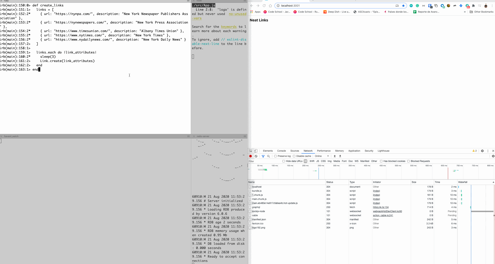

# GraphQL Subscriptions with Rails, ActionCable and React.js

## Description

This repository contains a POC implementing GraphQL subscriptions using [Rails](https://rubyonrails.org/), [GraphQL](https://graphql.org/), [ActionCable](https://guides.rubyonrails.org/action_cable_overview.html), [React.js](https://reactjs.org/) and [Apollo](https://www.apollographql.com/).

## Installation

Clone this repository in your local machine. You should have a [Redis](https://redis.io/) server running in `localhost:6379`:

### Backend

1. Run `bundle install` to install gems.
2. Run `rails db:create db:migrate db:seed` to run migrations and create seeds.
3. Run `rails s` to start the backend server in one tab.

### Frontend

1. Run `npm start` to start the client server in one tab.

By default the backend runs in `localhost:3000` and the client on `localhost:3001`.

## How it works?

Every time a new `link` record is created in the Rails backend the client is notified through a GraphQL subscription. Check the next .gif file to see it in action:

## Additional

Please let me know if you have any comments, questions, or feedback, it will be very appreciated.
